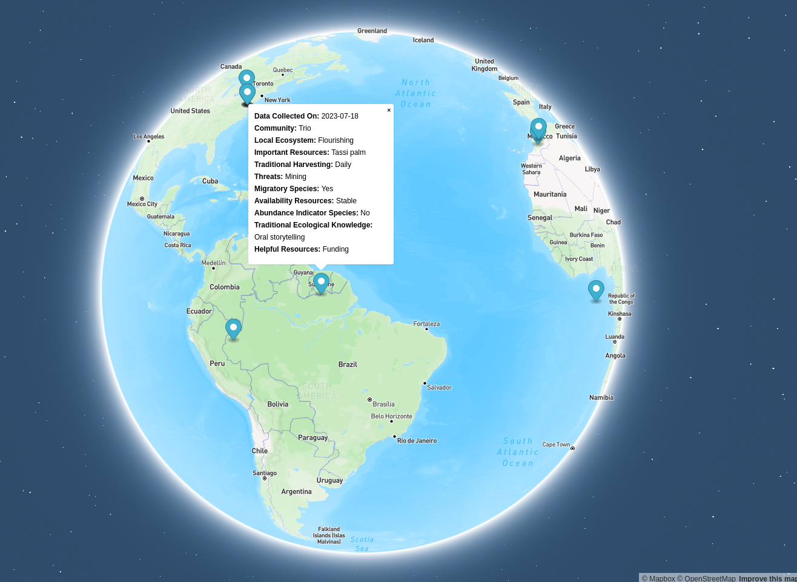

# GuardianConnector map

This is a proof-of-concept Mapbox map for GuardianConnector which connects to either a SQLite or PostgreSQL database, gathers survey submissions and if they have coordinates, renders them as points on the map. The survey data is shown in a popup.

To get started, copy `.env.example` to `.env` and add your database information and Mapbox access token.

To use SQLite instead of Postgres, set the `SQLITE` value to `YES`.

For now, media attachments are just given by filename, but we can render them once we are storing them in addition to the tabular data.

Right now, the data parsing is set to work with KoboToolbox data as received and stored by [Frizzle](https://github.com/ConservationMetrics/frizzle). As we change the way Frizzle parses the data, or as we start to support ingestion of data from other sources (e.g. ODK and Mapeo), this will need to evolve.

_Example map using KoboToolbox data._