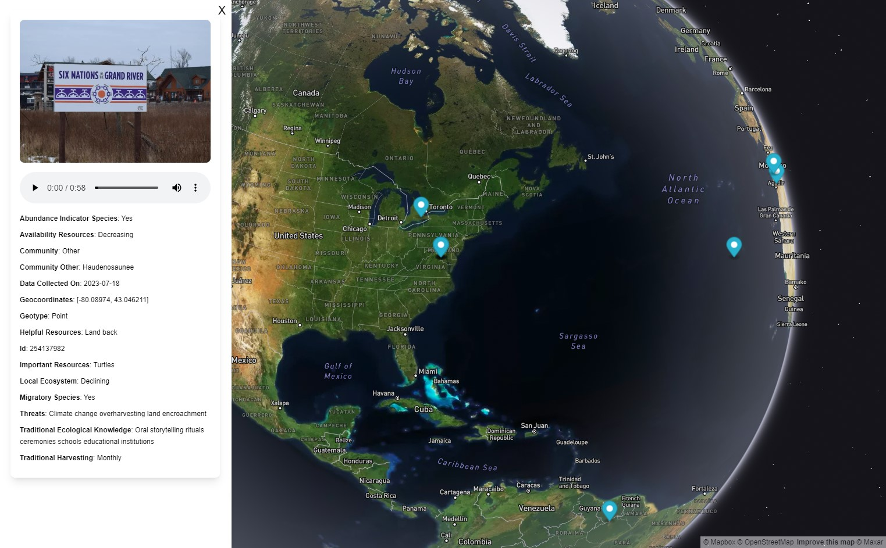

# GuardianConnector Views

This tool, designed for GuardianConnector and built using [Nuxt](https://nuxt.com/), offers an API compatible with SQLite or PostgreSQL databases, and renders tabular data from one or more tables on different views including a map and a media gallery.

## Configure

To get started, copy `.env.example` to `.env` and add your database and table information, authentication, and a Mapbox access token.

**Database:** Provide your database information in the relevant variables. To use SQLite instead of Postgres, set `SQLITE` to `YES` and provide a path value for `SQLITE_DB_PATH` (you can ignore `DATABASE` and the `DB_` ones).

**Authentication strategy:** GuardianConnector Views supports three different authentication strategies: auth0, password (from an environmental var) with JWT key, or none. Set your authentication strategy in `NUXT_ENV_AUTH_STRATEGY`.

* If you are using an auth0 strategy, then you need to provide a domain, client ID, client secret, audience, and base URL.
* If you are using a password strategy, then you need to provide a password, and secret JWT key.

**Vue API key:** Generate an API key to add to request headers made by the Nuxt front end. You can generate one by running `openssl rand -base64 42`.

**Mapbox access token:** Provide an access token to be used across the application for authenticating with Mapbox maps. (As of this moment, we are assuming that one token is sufficient for all maps views used, but we can revisit this if needed.)

**Views configuration:** GuardianConnector Views can render multiple tables and you can determine which views to show for each table. To configure your tables and views, set the multi-line variable `NUXT_ENV_VIEWS_CONFIG`. For more information on this, please see [config.md](docs/config.md). You do not need to set this in order for GuardianConnector Views to start, however the index page will show an empty list and none of the view routes will load anything.

## Build Setup

```bash
# install dependencies
$ npm install

# serve with hot reload at localhost:8080
$ npm dev

# build for production and launch server
$ npm build
$ npm start

# generate static project
$ npm generate
```

Add `--hostname 0.0.0.0` if you want the app to be accessible across your local network.

## Deployment

For deployment (e.g. on Azure), the following additional env vars are needed:

```
HOST: 0.0.0.0
NODE_ENV: production
```

If you are using Docker for deployment, you need to parse your `.env` file to 
turn the multi-line variable `NUXT_ENV_VIEWS_CONFIG` into a single line. To do so,
Run the `dockerenv.sh` script to generate a `.env.docker` file that can be used in Docker (or to supply environmental variables elsewhere, like on Azure):

```sh
./bin/dockerenv.sh
```

Local deployment of Docker:

```sh
docker run --env-file=.env.docker -it -p 8080:8080 guardianconnector-views:latest
```

## Available Views

### **Map**


_Map view using sample KoboToolbox data, with an image and audio attachment embedded._

### **Gallery**


_Gallery view using sample KoboToolbox data._

### **Alerts (change detection)**


_Alerts dashboard view with fake alerts data._

## How it works

### Column headers ###

Currently, GuardianConnector expects these column headers, which follow the structure of a GeoJSON feature. You can use these [GeoJSON to SQL conversion scripts](https://github.com/rudokemper/geojson-csv-sql-conversion-tools) to transform your GeoJSON file into the expected format if needed.

| SQL Column | GeoJSON Field |
|------------|---------------|
| id         | id            |
| g\_\_type    | geometry.type |
| g\_\_coordinates | geometry.coordinates |
| p\_\_...     | properties... |
| p\_\_\_...     | properties.$... |

If found, GuardianConnector Views will use a column mapping SQL table (with "__column" suffix), like the one created by the `warehouse` component of [Frizzle](https://github.com/ConservationMetrics/frizzle), to handle filtering and key/value rewrites.

 Any fields specified in the `.env` file will be filtered out (*see "Unwanted columns and substrings" above*).

At this time, media attachments in the popups are handled in a somewhat brittle way by embedding any strings that end in the expected photo, audio, or video file ending (such as `.jpg`, `.mp3`, or `.mp4`). We can improve on this later when we know more about how media attachments will be stored in the SQL database, and what kind of metadata we have access to.

### GeoJSON export formats for map view ###

The GuardianConnector Views map will render the feature on a map in accordance to what kind of `type` it is (Point, LineString, Polygon). The properties fields are shown in a popup opened by clicking on the feature.

The GuardianConnector Views map can work with any GeoJSON data stored in the expected tabular format, but the main purpose is to visualize field data collected using data collection applications such as Mapeo, OpenDataKit (ODK), and KoboToolbox. 

* Mapeo data from Mapeo Desktop is already exported as GeoJSON file. GuardianConnector map can work with both Observations and Territory data.
* ODK / KoboToolbox API survey data with a geospatial field may be transformed into such a format (as CMI does using [Frizzle](https://github.com/ConservationMetrics/frizzle) components).
* In the future, we can do a similar transformation for Mapeo Cloud API data, if needed.
