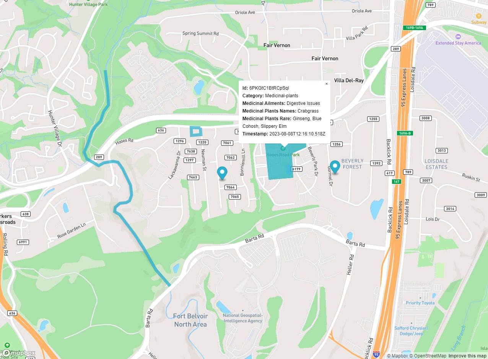

# GuardianConnector map

This is a Mapbox tool for GuardianConnector which connects to a SQLite or PostgreSQL database, and renders tabular GeoJSON data on a map. 

## Configure

To get started, copy `.env.example` to `.env` and add your database and table information, and a Mapbox access token. Other Mapbox fields are optional.

**Database:** to use SQLite instead of Postgres, set  `SQLITE` to `YES`.

**Media attachments:** if your GeoJSON data is storing filenames for media attachments, you can embed them by setting `EMBED_MEDIA` to `YES`, and by providing the path to the exact directory where media attachments are stored in `MEDIA_PATH`.

**Unwanted columns and substrings:** Many GeoJSON outputs from data collection APIs have a lot of extraneous metadata fields that are not useful to the viewer and can clutter up the popup on the map (see [docs/schema.md](docs/schema.md) to see a list of these fields output by popular data collection APIs). You can determine which fields to filter out in `UNWANTED_COLUMNS` (exact column names will be filtered) and `UNWANTED_SUBSTRINGS` (all columns which include these substrings will be filtered).

## How it works

### Column headers ###

Currently, GuardianConnector map expects these column headers, which follow the structure of a `feature` in a GeoJSON file. You can use these [GeoJSON to SQL conversion scripts](https://github.com/rudokemper/geojson-csv-sql-conversion-tools) to transform your GeoJSON file into the expected format.

| SQL Column | GeoJSON Field |
|------------|---------------|
| id         | id            |
| g\_\_type    | geometry.type |
| g\_\_coordinates | geometry.coordinates |
| p\_\_...     | properties... |
| p\_\_\_...     | properties.$... |

GuardianConnector map will render the feature on a map in accordance to what kind of `type` it is (Point, LineString, Polygon). The properties fields are shown in a popup opened by clicking on the feature. Any fields specified in the `.env` file will be filtered out (*see "Unwanted columns and substrings" above*).

If found, GuardianConnector map will use the column mapping SQL table (with "__column" suffix) created by the `warehouse` component of [Frizzle](https://github.com/ConservationMetrics/frizzle) to handle popup filtering and key rewrites. If no column mapping table is found, then GuardianConnector map will filter the Object keys of the data itself.

At this time, media attachments in the popups are handled in a somewhat brittle way by embedding any strings that end in the expected photo, audio, or video file ending (such as `.jpg`, `.mp3`, or `.mp4`). We can improve on this later when we know more about how media attachments will be stored in the SQL database, and what kind of metadata we have access to.

### GeoJSON export formats ###

GuardianConnector map can work with any GeoJSON data stored in the expected tabular format, but the main purpose is to visualize field data collected using data collection applications such as Mapeo, OpenDataKit (ODK), and KoboToolbox. 

* Mapeo data from Mapeo Desktop is already exported as GeoJSON file. GuardianConnector map can work with both Territory and Observations data.
* ODK / KoboToolbox API survey data with a geospatial field may be transformed into such a format (as CMI does using [Frizzle](https://github.com/ConservationMetrics/frizzle) components).
* In the future, we can do a similar transformation for Mapeo Cloud API data, if needed.

_Example map using KoboToolbox data, with an image and audio attachment embedded._

_Example map using Mapeo data showing all three geometry types._